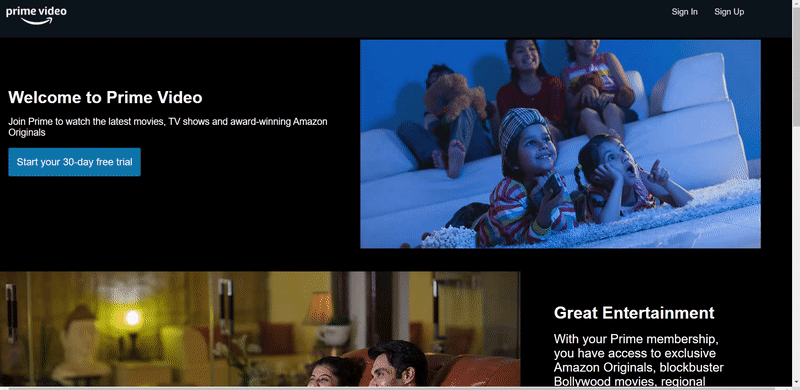
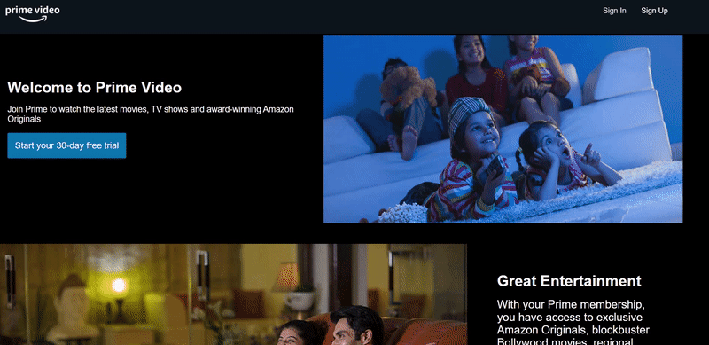
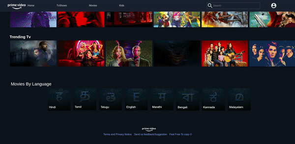
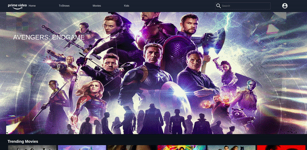
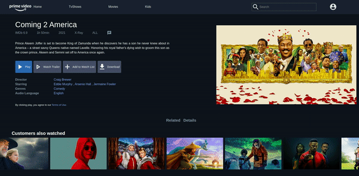
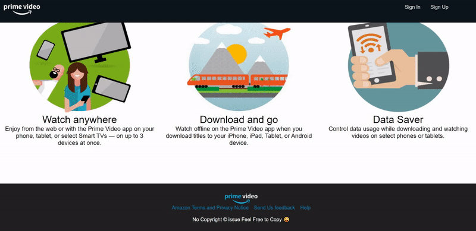
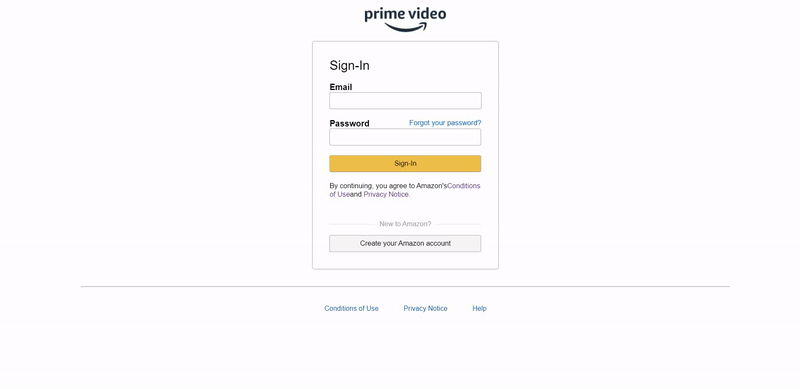
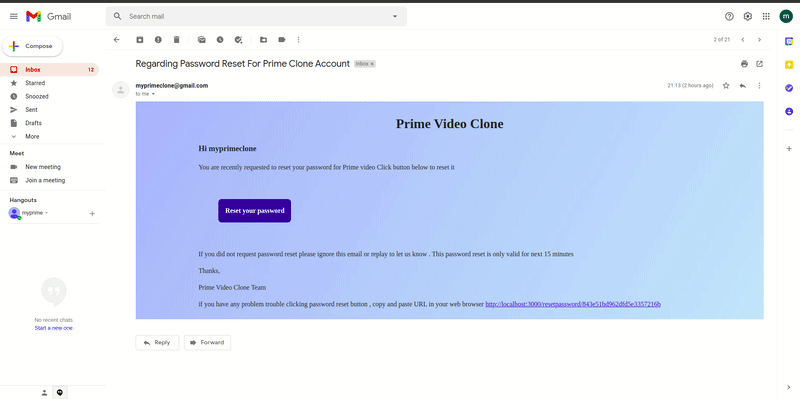

# Amazon Prime Video Clone

This project is amazon prime video  clone build in MERN Stack. 

Hosted on netlify https://myprimeclone.netlify.app/


**Features** 

* Registered and Guest users can Watch the trailer of movies
* Select movies by different language
* Only registered user can add movies and tv shows to their watchlist
* While resetting the password registered user will receive email and through the link present inside the email user will reset the password 


## **Gifs**

### Weclome page
* Desktop view


* Mobile view 


### Signin page



### Signup page


### Home page


### Watch in your language


### Tv Shows page


### Movies page


### Kids page


### Watch Trailer


### Feedback form 


### Form footer


### Password reset link is inactive



**Reference** : 

* Icons are used from  material ui  
    https://material-ui.com/components/material-icons/

* All movie and tv shows information taken  from TMDB API 
    https://developers.themoviedb.org/3

* To play trailer react-youtube npm package used 
    https://www.npmjs.com/package/react-youtube 


**There are two methods for getting started with this repo.**


#### Familiar with Git ?

```
> git clone https://github.com/bhagat-hrishi/amazon-prime-clone.git
> cd client
> npm install
> npm start
> cd server 
> npm install
> node index
```

#### Not Familiar with Git ?
download the .zip file.  Extract the contents of the zip file, then open your terminal, change to the project directory, and:

```
> cd client
> npm install
> npm start
> cd server 
> npm install
> node index
```

**Configuration for .env file** 
* Note 
    
    Create *.env*  file in client and server folder

*  Content of .env For client

    REACT_APP_API_KEY = Enter your tmdb api key

* Content of .env For server

    MONGO_ATLAS_PW = dbpassword

    GMAIL_PASS = email password

    FEEDBACK_GMAIL = email id

    DB_URL = db url from mongodb atlas


